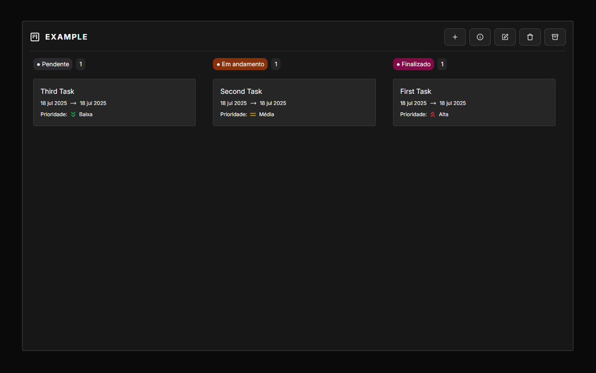

# 📁 Project Manager

Um sistema simples e eficiente para gerenciar projetos e suas tarefas. Este repositório contém o código-fonte de um gerenciador de projetos desenvolvido com foco em produtividade, organização e facilidade de uso.

<h1 align="center">
  
</h1>

## 🚀 Funcionalidades

- ✅ Cadastro e edição de projetos
- ✅ Cadastro de tarefas por projeto
- ✅ Kanban simples para gestão visual
- ✅ Dashboard com progresso dos projetos

## 📚 Tecnologias Utilizadas

- **Backend:** Node, SQLite, Fastify, Prisma, Zod
- **Frontend:** React, Shadcn, Tailwind, Radix UI, React Query

## 💻 Como Rodar Localmente

1. **Clone o repositório:**

```bash
git clone https://github.com/TiagoFreitas03/project-maneger.git
```

2. **Acesse a pasta do projeto:**

```bash
cd project-manager
```

3. **Backend:**

```bash
# a partir do diretório raíz entre na pasta da aplicação backend
cd backend
# instale as dependências
npm install
# crie o arquivo .env e configure as variáveis de ambiente
cp .env.example .env
# execute a aplicação backend
npm run dev
```

4. **App Web:**

```bash
# a partir do diretório raíz entre na pasta da aplicação web
cd web
# instale as dependências
npm install
# crie o arquivo .env.local e configure as variáveis de ambiente
cp .env.example .env.local
# execute a aplicação web
npm run dev
```

## 🚪 Contribuição

Contribuições são bem-vindas! Para contribuir:

1. Fork este repositório
2. Crie uma branch com sua feature ou correção: `git checkout -b minha-feature`
3. Commit suas alterações: `git commit -m 'Minha feature'`
4. Push para o repositório remoto: `git push origin minha-feature`
5. Abra um Pull Request

## 📄 Licença

Este projeto está licenciado sob a Licença MIT. Veja o arquivo [LICENSE](LICENSE) para mais informações.

## 🙏 Agradecimentos

Este projeto foi inspirado em boas práticas de gestão ágil e ferramentas como Trello, Jira e Notion.

---

Desenvolvido por Tiago Faria.
